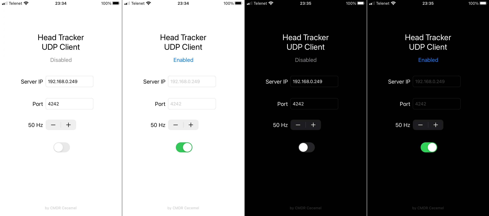
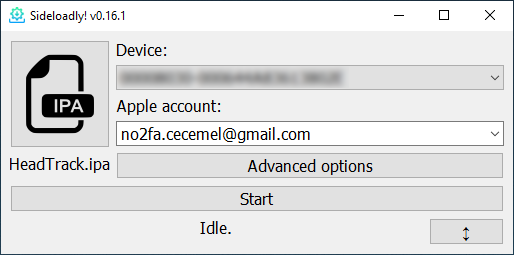
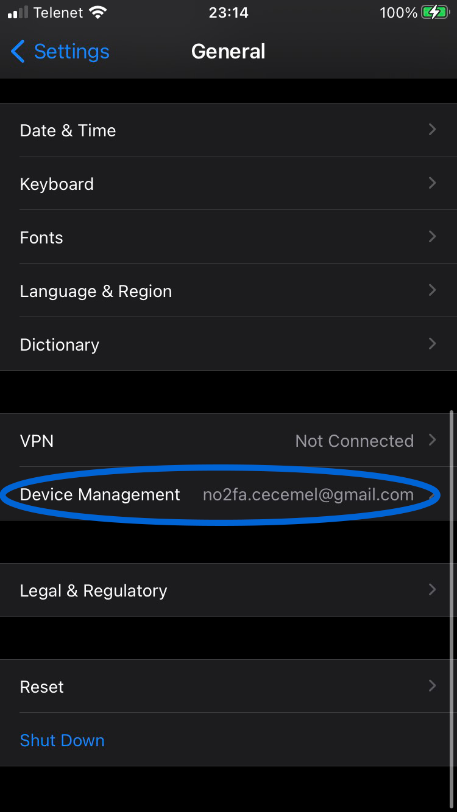
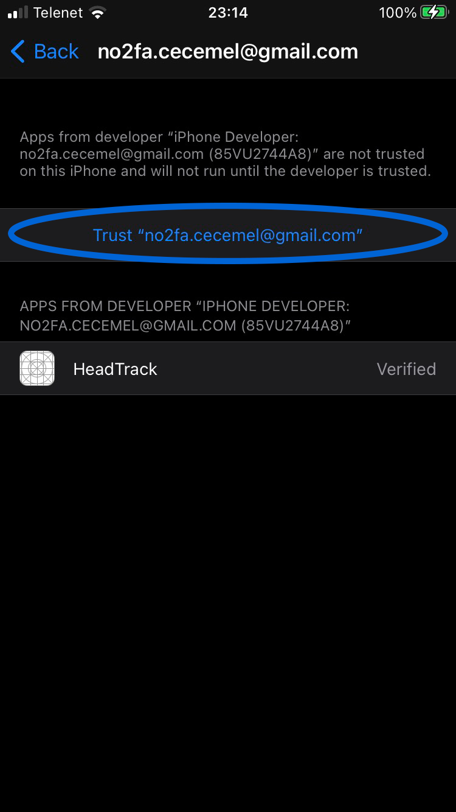

## Intro
This is a simple app which makes it possible to use your Apple device as a fairly low latency and high accuracy head tracker by mounting it to your head.

The app will wirelessly send its attitude, from the built-in accelerometer and magnetometer, to a computer running [Opentrack](https://github.com/opentrack/opentrack).

## Screenshots and video

#TODO: add video

## Pros and cons of using this method for facetracking
- You need to strap your phone to your head.
- This can only track your head's rotation, no translation.
- It's free. (Assuming you already own an Apple device)
- Lower latency and higher accuracy compared to visual (no-IR) tracking solutions.

I don't know how this compares to IR tracking as I can't test it myself. I'd assume the accuracy is comparable and the latency is a little higher. I'll update this if someone let's me know.

## Requirements
- An iPhone, iPod Touch or iPad*
- iOS 13.0+
- [Opentrack](https://github.com/opentrack/opentrack)
- A way to mount your device to your head

*The app works on iPad in case you want to test it, but I'd not recommend actually mounting an iPad to your head.

## Installation
This app is not available on the App Store, as I'm not going to pay 99 Euros/year for an Apple developer account. This means installing isn't as simple as pressing a button, instead you'll have to use a 3rd party tool to install unsigned apps to your device by signing them with your own Apple ID.

I've tested Sideloadly for Windows which worked fine.

<i>Click to unfold installation guide ...</i>

1. Install iTunes ([64bit](https://www.apple.com/itunes/download/win64)/[32bit](https://www.apple.com/itunes/download/win32)) if you haven't got it yet.
2. Install [Sideloadly](https://iosgods.com/topic/130167-introducing-sideloadly-working-cydia-impactor-alternative/).
3. Connect your device to your computer.
4. Start Sideloadly, you should see a bunch of letters/numbers in the 'Device' dropdown if your device is plugged in.
5. Go to [releases](), download the `.IPA` file and drag it to the Sideloadly window.
6. Enter your Apple ID you'll be using to sign the app. 
If you don't want to enter your own Apple ID into a random tool, you can use 'no2fa.cecemel@gmail.com'. This is an Apple ID without two-factor authentication (2FA) that I made specifically for this purpose. Send me a message on Discord (Cecemel#6035) to get the password. 

7. Click Start and enter the password for the Apple ID.
   - If you're using an account with 2FA, you'll get a message on an Apple device. Confirm it, it'll give you a 6-digit code that you'll need to enter in Sideloadly.
8. Wait a few seconds. If 'Done.' appears, the app is installed. I had to reboot my iPhone before it showed up on the homescreen.
9. Before you're able to start the app, you'll need to 'Trust' the Apple ID you used to sign the app. Go to Settings --> General on your device and scroll down. 

10. Go to 'Device Management', press the email address you entered previously, press the 'Trust ...' button and confirm. 

11. That's it, you should now be able to run the app.

## Usage
#TODO: Add usage

## Note
This is my first time writing an iOS app, using Xcode and using Git(Hub). The code writen will certainly not be ideal, but it runs pretty efficiently and doesn't seem to contain bugs. Bug reports, improvements, feature requests, ... are always welcome.

Also, feel free to suggest an app icon.

