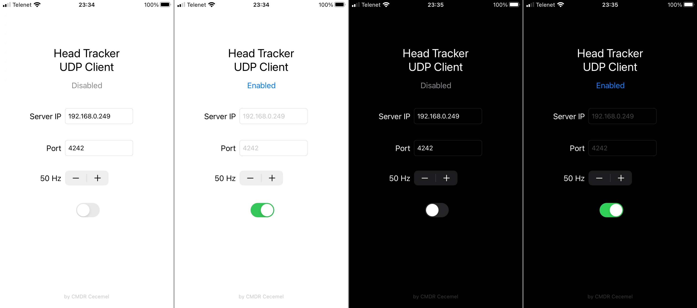

## Intro
This is a simple app which makes it possible to use your Apple device as a fairly low latency and high accuracy head tracker by mounting it to your head.

The app will wirelessly send its attitude, from the built-in accelerometer and magnetometer, to a computer running [Opentrack](https://github.com/opentrack/opentrack).

## Screenshots and video

#TODO: add video

## Pros and cons of using this method for facetracking
- You need to strap your phone to your head.
- This can only track your head's rotation, no translation.
- It's free. (Assuming you already own an Apple device)
- Lower latency and higher accuracy compared to visual (no-IR) tracking solutions.

I don't know how this compares to IR tracking as I can't test it myself. I'd assume the accuracy is comparable and the latency is a little higher. I'll update this if someone let's me know.

## Requirements
- An iPhone, iPod Touch or iPad*
- iOS 13.0+
- [Opentrack](https://github.com/opentrack/opentrack)
- A way to mount your device to your head

*The app works on iPad in case you want to test it, but I'd not recommend actually mounting an iPad to your head.

## Installation
This app is not available on the App Store, as I'm not going to pay 99 Euros/year for an Apple developer account. This means installing isn't as simple as pressing a button, instead you'll have to use a 3rd party tool to install unsigned apps to your device by signing them with your own Apple ID.

I've tested Sideloadly which seemed to work fine.

#TODO: Add detailed instructions

## Usage
#TODO: Add usage

## Note
This is my first time writing an iOS app, using Xcode and using Git(Hub). The code writen will certainly not be ideal, but it runs pretty efficiently and doesn't seem to contain bugs. Bug reports, improvements, feature requests, ... are always welcome.

Also, feel free to suggest an app icon.

